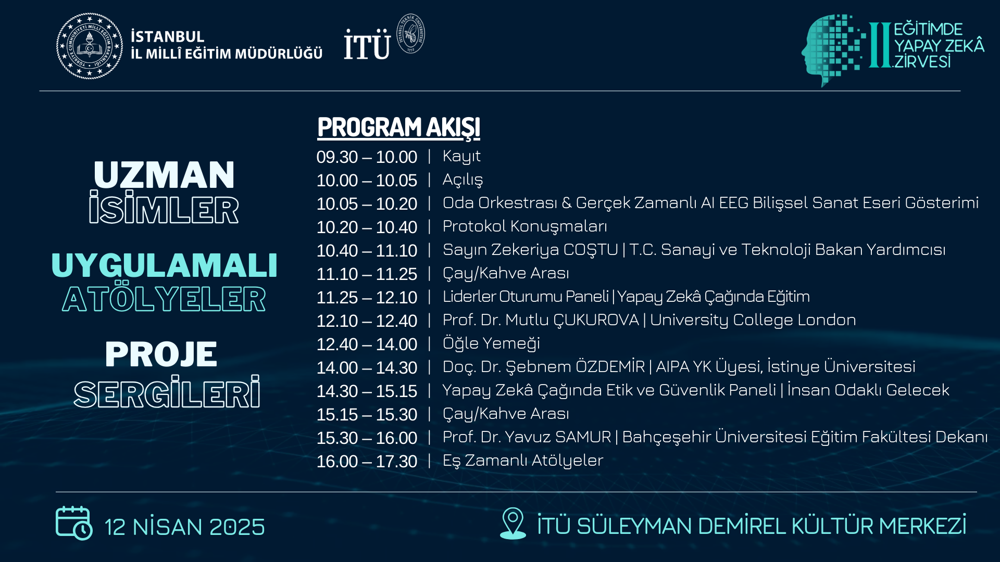

# İkinci Eğitimde Yapay Zeka Zirvesi

İstanbul İl Milli Eğitim Müdürlüğü ve İstanbul Teknik Üniversitesi iş birliğiyle düzenlenen **İkinci Eğitimde Yapay Zeka Zirvesi**, eğitimde yapay zekanın dönüştürücü potansiyelini, risklerini ve insani değerlerle entegrasyonunu ele almıştır.

## 📹 Zirve Videosu

## 📑 Zirve Bölümleri Özetleri
(özet başlıklarına tıklayarak her bölümün daha ayrıntılı raporuna ulaşabilirsiniz)

### [1. Eğitimde Yapay Zeka Zirvesi Genel Özeti](bolum1.md)
- **Tema**: Yapay zekanın eğitimde kişiselleştirilmiş öğrenme, fırsat eşitliği ve öğretmen rehberliği gibi alanlarda destekleyici rolü
- **Vizyon**: Türkiye Yüzyılı Maarif Modeli ile insan merkezli, etik ve değer odaklı teknoloji entegrasyonu
- **Yenilikler**: İstanbul'daki bilim ve teknoloji odaklı anaokulları ve Türkiye'nin ilk yapay zeka ve siber güvenlik lisesi

### [2. Saadullah Uzun Sunumu: Milli Teknoloji Hamlesi ve Eğitim](bolum2.md)
- **Milli Teknoloji Hamlesi**: Türkiye'nin teknoloji üreten bir ülke olma hedefi
- **Yapay Zeka Durumu**: TÜBİTAK'ın Türkçe büyük dil modeli geliştirme çalışmaları
- **Eğitim Projeleri**: Otomatik soru üretimi, kişiselleştirilmiş çalışma planları ve dijital mentör uygulamaları

### [3. Liderler Oturumu: Küresel Trendler ve Türkiye'nin Yol Haritası](bolum3.md)
- **Fırsatlar**: Kişiselleştirilmiş öğrenme, içerik üretimi ve dil öğrenimi alanlarındaki potansiyel
- **Tehditler**: Önyargılar, veri güvenliği ve hukuki sorumluluk riskleri
- **MEB Stratejisi**: Temkinli yaklaşım; yapay zekanın öğretmeni desteklemesi, yerini almaması

### [4. Mutlu Çukurova Sunumu: Yapay Zeka ve İnsani Değerler](bolum4.md)
- **Potansiyel**: Materyal hazırlama, geri bildirim ve zaman tasarrufu avantajları
- **Riskler**: Halüsinasyon, önyargılar, insansızlaştırma ve standartlaşma
- **UNESCO Raporu**: Öğretmenlerin yapay zekayı etik ve insan odaklı kullanması gerekliliği

### [5. Şebnem Özdemir Sunumu: Eğitim ve İnsani Perspektif](bolum5.md)
- **Yapay Zeka Evrimi**: Üretken yapay zekanın gelişimi ve beraberinde getirdiği sorunlar
- **Riskler**: Beyin çökmesi, kültürel yabancılaşma ve bağımlılık
- **Yerli Çözümler**: Görse ve diğer girişimlerin kültürel kimlik ve bağımsızlığa katkıları

### [6. Etik ve İnsan Odaklı Gelecek Paneli](bolum6.md)
- **Gençlerin Hazırlığı**: Yaratıcılık, eleştirel düşünme, takım çalışması ve erdem becerileri
- **Etik Dışı Veri**: Rızasız toplama, mahremiyet ihlali ve önyargılı veriler
- **Çözümler**: Yerli modeller, farkındalık, ebeveyn denetimi ve dengeli regülasyon önerileri

### [7. Yavuz Samur Sunumu: Öğretmenin Yeni Rolü](bolum7.md)
- **Yapay Zekanın Yaygınlığı**: Öğrencilerin ödevlerde yapay zeka kullanımı ve eğitimde yeni yaklaşımlar
- **Kişiselleştirme**: Her öğrenciye özel öğrenme imkanları
- **Öğretmenin Rolü**: Yapay zeka okuryazarlığı, eleştirel düşünme ve etik öğretimi

## 📝 Genel Değerlendirme

Zirve, yapay zekanın eğitimde dönüştürücü gücünü vurgularken, etik, veri güvenliği, önyargılar ve insani değerlerin korunması gerektiğini ortaya koymuştur. Türkiye, yerli modeller, beceri odaklı eğitim ve iş birliğiyle küresel arenada öncü olmayı hedeflemektedir. Öğretmenler, hibrit zeka çağında yaratıcılık, eleştirel düşünme ve erdemle nesilleri şekillendirecek; yapay zeka ise destekleyici bir araç olarak konumlanacaktır.

**Tarih**: 12 Nisan 2025  
**Hazırlayan**: Grok 3, xAI
